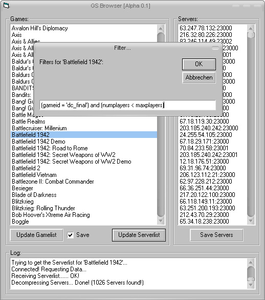



## GS Browser \- Get Serverlists from GameSpy

### Description

Get Serverlists from the public GameSpy Master!
 
### More Info
 

             |
---                |---
**Submitted On**   |2004-10-15 17:49:06
**By**             |[Thomas Reiser](https://github.com/Planet-Source-Code/PSCIndex/blob/master/ByAuthor/thomas-reiser.md)
**Level**          |Beginner
**User Rating**    |5.0 (15 globes from 3 users)
**Compatibility**  |VB 6\.0
**Category**       |[Internet/ HTML](https://github.com/Planet-Source-Code/PSCIndex/blob/master/ByCategory/internet-html__1-34.md)
**World**          |[Visual Basic](https://github.com/Planet-Source-Code/PSCIndex/blob/master/ByWorld/visual-basic.md)
**Archive File**   |[GS\_Browser1841661192005\.zip](https://github.com/Planet-Source-Code/thomas-reiser-gs-browser-get-serverlists-from-gamespy__1-58372/archive/master.zip)

